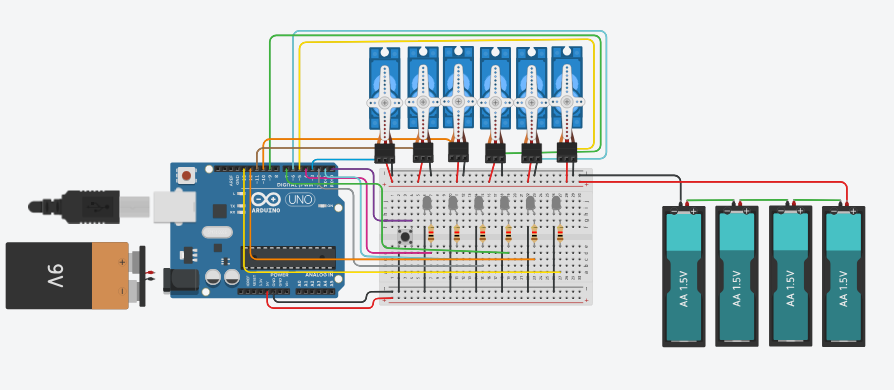

# Vestido Robótico Interativo 👗🤖

Projeto interdisciplinar unindo tecnologia e alta costura, desenvolvido como trabalho final para a disciplina de **Introdução à Engenharia de Computação (UFPB)** em parceria com o **Projeto Runway (Moda - UNIPÊ)**.

## 🌟 Motivação e Conceito
Este trabalho é uma homenagem a todas as mulheres que lutaram para ocupar espaços na ciência e na tecnologia. Inspirado pelo **Efeito Matilda** (o apagamento histórico de mulheres na STEM), o vestido celebra pioneiras como Marie Curie, Mileva Marić e Henrietta Leavitt. 

Como diz Marian Wright Edelman: *"Você não pode ser o que não pode ver."* — este projeto visa criar visibilidade para mulheres engenheiras e criadoras.

---

## 🛠️ O que é o Vestido Arduino?
O projeto integra rosas de tecido que giram através de servos motores controlados por um Arduino Uno. Cada flor possui um LED central que representa seu miolo, criando um efeito visual dinâmico e iluminado.

### Tecnologias e Componentes
- **Hardware:** Arduino Uno, 6 Micro Servos SG90, 6 LEDs brancos, Resistores, Bateria 9V e Pilhas AA.
- **Estrutura:** Placa de fenolite perfurada, fiação de cobre encapada e suporte mecânico para as rosas.
- **Software:** Programação em C++ utilizando a biblioteca `Servo.h`.

---

## 👥 Equipe Desenvolvedora

### Grupo Engenharia (UFPB)
- **Maria Eduarda Cavalcanti Mendes** (Programação e Esquemático)
- **Mariana Pontes** (Programação e Esquemático)
- **Maria Luísa Quintela** (Soldagem, Fenolite, Recorte e Roteiro)
- **Maria Clara Santos** (Pesquisa Histórica e Social)

### Grupo Moda (UNIPÊ)
- **Atlas Gabriel Ramalho**
- **Beatriz Bispo**
- **Marggory Ellen Santos**
- **Irineide Dalva**
- **Gabriel Andrade da Silva**
- **Prof. Dyana Barreto** (Coordenação de Modelagem e Costura)

---

## 🏗️ Divisão de Tarefas
- **Técnica:** Programação do Arduino, montagem do circuito, soldagem e isolamento térmico/elétrico.
- **Criação:** Pesquisa de tendências, desenho (croquis), modelagem 3D para 2D e confecção têxtil.
- **Social:** Pesquisa sobre o papel da mulher na indústria têxtil pós-guerra e ascensão feminina no mercado de trabalho.

---

## 📁 Estrutura do Código
- `vestido.cpp`: Lógica principal que alterna o movimento entre dois grupos de servos e controla o estado dos LEDs através de um botão de acionamento.

---

## 🤖 Esquemático do Circuito

